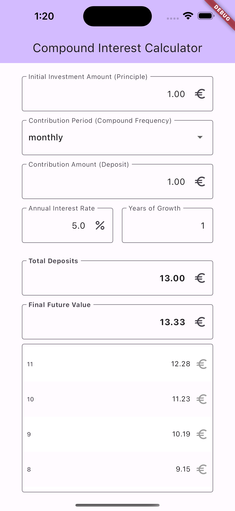
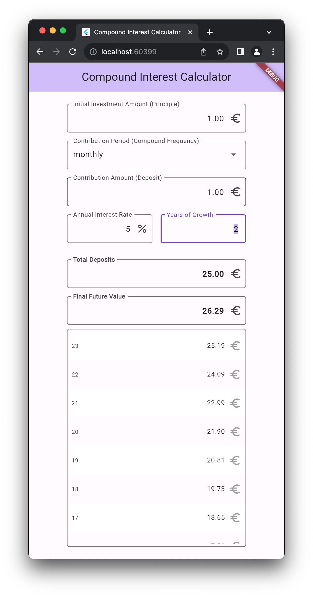

# Compound Interest Calculator Client

Visualize compound interest calculations.

The Flutter applications lists the `compound-interest` library as its dependency
in the [pubspec.yaml](./pubspec.yaml) and visulizes the results of the
`CompoundInterest` class, accordingly inputs provided during initialization.

## Running

List the available devices:

```sh
futter devices
```

Then pick the device id respctive to your setup. For example:

### Running for web

```sh
futter run -d chrome
```

### Running for iOS simulator

```sh
open -a simulator
flutter devices
flutter run -d <ios-simulator-id>
```

## Screenshots



